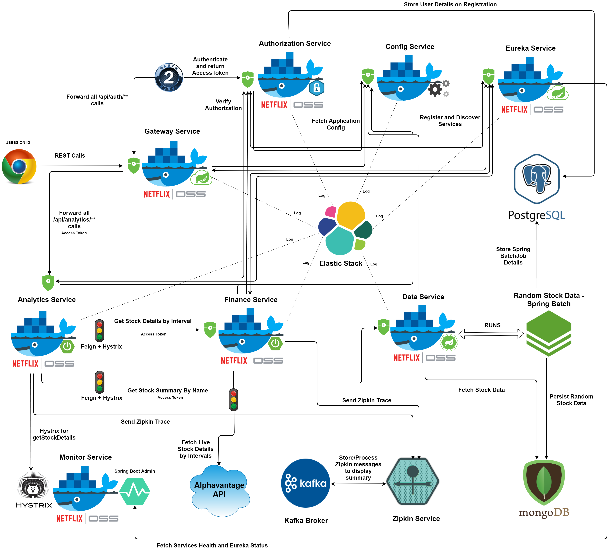

# Spring Micro Services Showcase

[Microservices](https://microservices.io/) is an architectural style that structures an application as a collection of loosely coupled services, where each service implements business capabilities. A microservice runs in its own process and communicates other services via HTTP API. Every microservice can be deployed, upgraded, scaled, and restarted independently of the other services in an application.
It enables continuous delivery/deployment of large, complex applications. It allows better component isolation and high resilience against component failures. Smaller components in microservices can be scaled easily to meet increasing demand for a specific component. It increases developer independence and allows parallel development across multiple smaller teams.
Microservices brings additional complexity as the developers have to mitigate fault tolerance, network latency, and deal with load balancing. Also deployment and testing of such a distributed system is complicated and tedious.

[Spring Boot](https://docs.spring.io/spring-boot/docs/1.5.10.RELEASE/reference/htmlsingle/) enables to spawn stand-alone, production-grade Spring-based Applications with very little configuration, hence it is widely used in micro services arena. It is preconfigured with the Spring's standard configuration and has an embedded Tomcat or Jetty to provide full fledged server functionality.
[Spring Cloud](http://projects.spring.io/spring-cloud/) framework, provides a collection of tools and solutions to some of the commonly encountered patterns when building distributed systems. It addresses solutions for some of the common problems in distributed systems including Configuration management, Service discovery, Circuit breakers and Distributed sessions.
[Docker](https://www.docker.com/) is a open platform to create, deploy, and run applications as a lightweight, portable, self-sufficient container, which can run virtually anywhere.
These tools and platforms form the foundation for spring micro services project.

The spring micro services showcase contains the following services in action:

* [Elastic Stack](elastic-stack/README.md): ElasticSearch-Logstash-Kibana provides log storage and management.
* [Kafka Broker](kafka-broker/README.md): Kafka Message broker provides messaging capabilities to zipkin trace messages to Zipkin server.
* [Zipkin Service](zipkin-service/README.md): Zipkin enables to trace requests spanning across multiple services.

* [Config Service](config-service/README.md): Configuration service provides access to spring **application.yml** configuration files for corresponding service stored in its centralized (currently local) location.
* [Discovery Service](discovery-service/README.md): Eureka discovery service allows micro services to find and communicate with each other.
* [Authorization Service](authorization-service/README.md): Authorization service is responsible for providing OAuth2 access tokens after authentication and validating request access tokens before allowing access to the authorized services.
* [Data Service](data-service/README.md): Data service provides reactive services using Spring WebFlux to fetch various data (currently stock data).
* [Finance Service](finance-service/README.md): Finance service provides services to fetch financial data especially stock details.
* [Analytics Service](analytics-service/README.md): Analytics services consume data from various sources, mainly finance-service and data-service and provide analytical details regarding the corresponding data.
* [Monitor Service](monitor-service/README.md): Monitor service gathers hystrix circuit breaker data from finance and analytics services, and displays the [Hystrix Dashboard](https://github.com/Netflix-Skunkworks/hystrix-dashboard). It also includes [Spring Boot® Admin](https://github.com/codecentric/spring-boot-admin) dashboard which helps to monitor, manage and configure spring microservices.

   

## Setup and Running on Docker (Single Instance)

* Run the [ubuntu-docker-setup.sh](ubuntu-docker-setup.sh) script to setup java, gradle, docker and docker-compose. The script is specific to Ubuntu Bionic operating system but can be used as setup reference for other Linux systems as well.
* Compile and build all the microservices using gradle with below command. For now ignore the tests with **"-x test"** as this is still work in progress.

        $ gradle build -x test

* All the password variables in docker-compose.yml file are read from below system environment variables. Replace the below shell variables with corresponding password values to be used by individual services. If no value is provided for the below password variables then their value is treated as blank.

        $ export POSTGRES_PASSWORD=$POSTGRES_PASSWORD
        $ export MONGO_INITDB_ROOT_PASSWORD=$MONGO_INITDB_ROOT_PASSWORD
        $ export CONFIG_SERVICE_PASSWORD=$CONFIG_SERVICE_PASSWORD
        $ export CONFIG_KEYSTORE_PASSWORD=$CONFIG_KEYSTORE_PASSWORD
        $ export CONFIG_KEY_PASSWORD=$CONFIG_KEY_PASSWORD
        $ export AUTH_SERVICE_PASSWORD=$AUTH_SERVICE_PASSWORD
        $ export FINANCE_SERVICE_PASSWORD=$FINANCE_SERVICE_PASSWORD
        $ export ANALYTICS_SERVICE_PASSWORD=$ANALYTICS_SERVICE_PASSWORD
    
* Use below docker-compose command to download images, create and start containers instances. The **"-E"** option allows to read all the newly created environment variables from the previous step.

        $ sudo -E docker-compose up -d

### Testing Microservices using Postman 

[Postman](https://www.getpostman.com/) is a client to test various HTTP services. [Download Postman](https://www.getpostman.com/downloads/) and install in your system.
Open postman application, go to `File` -> `Import` opening import dialog. Click on `Choose Files` to import and select the [spring-microservices.postman_collection.json](spring-microservices.postman_collection.json) from the repository.
After import you see the collection `spring-microservices` on the left-side menu. Referring the [postman docs](https://learning.getpostman.com/docs/postman/environments_and_globals/manage_environments/), create environment, create variables namely `hostname` and select the environment before sending service requests.

### Docker Setup Notes 

* The above **docker-compose up -d** command would create all the containers and start all the services parallelly in background. Since virtually all the services are dependent on few core services namely postgres-service, config-service, discovery-service and authorization-service, this would cause other services to fail and restart again until they establish successful connections with core services. 
* It is important to note that docker-compose detects changes in the environment variables compared to existing service instance running with different environment variables. On launching a new service which depends on an already existing service whose environment variables are altered, docker-compose would first trigger recreation of existing (dependent) service instance with the current system environment variables before creating the launched instance.
