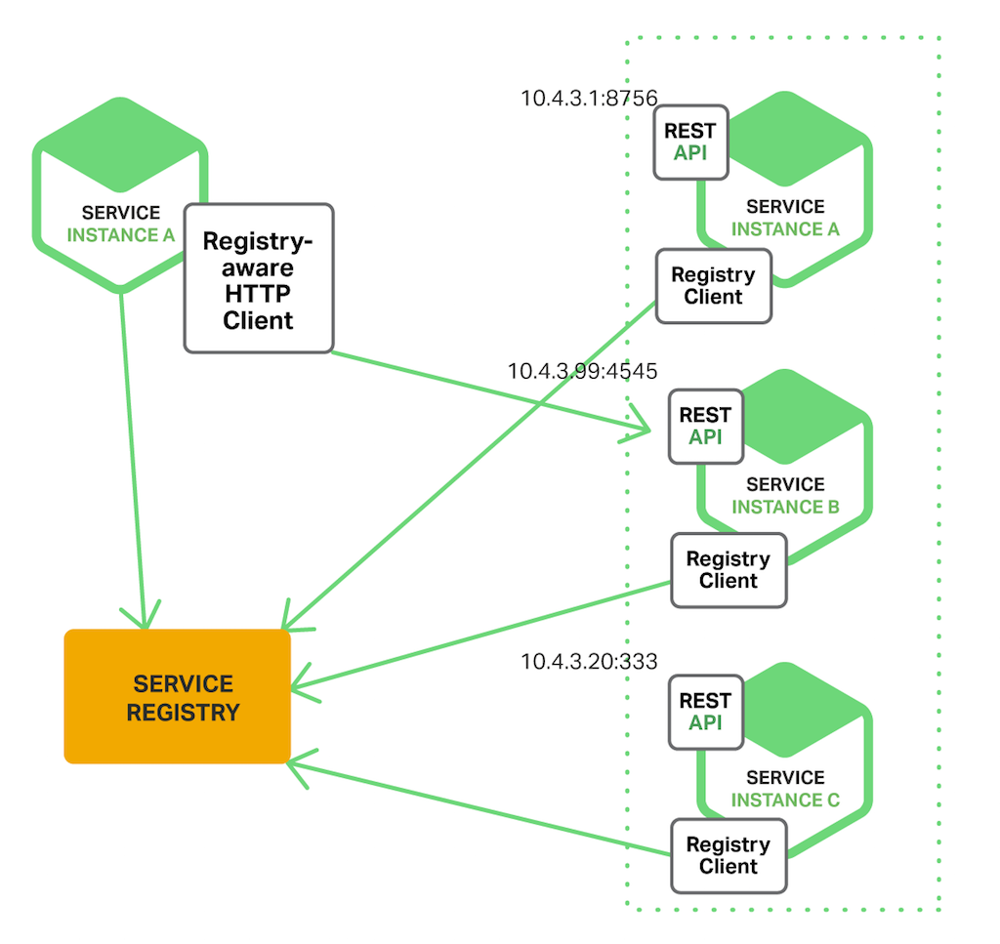

Discovery Service (Netflix Eureka)
=============

Client-side service discovery allows services to find and communicate with each other without hard coding hostname and port. In [client side discovery pattern](https://www.nginx.com/blog/service-discovery-in-a-microservices-architecture/), the client is responsible for determining the network locations of available service instances and load balancing requests across them. The client first queries the service registry, which has list of all available service instances. The client then uses a load balancing algorithm to select one of the available service instances to make a request.
The drawback of client side discovery is that all clients must implement a certain logic to interact with the fixed service registry. This assumes an additional network round trip before making an actual request.
[Netflix Eureka](http://cloud.spring.io/spring-cloud-netflix/single/spring-cloud-netflix.html#_service_discovery_eureka_clients) Server is a service registry while Eureka Client is a Discovery client. It provides a REST API for managing service instance registration and for querying available instances.
With Netflix Eureka each client can simultaneously act as a server, to replicate its status to a connected peer. The client retrieves a list of all connected peers of a service registry and makes all further requests to any other services through a load-balancing algorithm. The client also sends a heartbeat signal to the registry.

   
   
### Running the Discovery Service

The **CONFIG_SERVICE_PASSWORD** is a required parameter to run discovery-service as it enables to access discovery-service.yml configuration file from the [config-service](../config-service/README.md).
Optionally **spring.profiles.active** can be passed with value **production** which enables logback to send all logs to [Elastic Stack](../elastic-stack/README.md) instead of logging in the console by default.

    $ java -jar discovery-service/build/libs/discovery-service-0.0.1-SNAPSHOT.jar
           -DCONFIG_SERVICE_PASSWORD=xxxx
		   -Dspring.profiles.active=production

