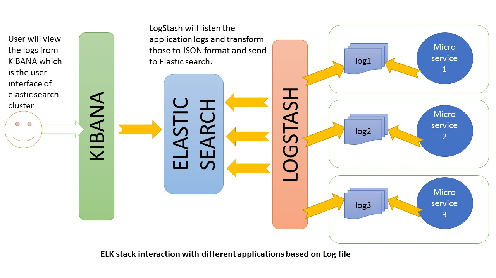

Elastic Stack (Elasticsearch, Logstash and Kibana)
=============

Elastic Stack is a collection of three projects Elasticsearch, Logstash, and Kibana which enable to log/filter messages and search/analyze logs. The Elastic Stack is the next evolution of the ELK Stack.

   

## ElasticSearch

[Elasticsearch](https://www.elastic.co/guide/en/elasticsearch/reference/current/getting-started.html) is highly scalable distributed search and analytics engine based on [Apache Lucene](https://lucene.apache.org/). It allows to store, search, and analyze big volumes of documents quickly and in near real time. It also supports realtime time indexing and multitenancy. It also enables percolating for notifying if new documents match for registered queries. It exposes a Java and an HTTP API, which can be used for indexing, searching and most of the configuration. Elasticsearch is a NoSQL database and sits at the heart of Elastic Stack.

### Installation and Running of Elasticsearch

* Download latest [Elasticsearch release](https://www.elastic.co/downloads/elasticsearch) and extract the tar.gz or zip file. 
* Update the elasticsearch.yml file in ELASTICSEARCH_HOME\config directory with 'network.host' and 'http.port' to the host address and preferred port number for elasticsearch. Also update the 'path.data' and 'path.logs' to corresponding paths to store elasticsearch documents and logs.   
* ELASTICSEARCH_HOME is the path to extracted Elasticsearch directory. Go to ELASTICSEARCH_HOME\bin directory and execute the command "elasticsearch.bat" to run elasticsearch.
* Elasticsearch runs on default port 9200.

All the above steps can be executed directly by running below runElasticsearch gradle task for windows.

    $ gradle runElasticsearch

## Logstash

[Logstash](https://www.elastic.co/guide/en/logstash/current/introduction.html) is an open source data collection engine with real-time pipelining capabilities. Logstash allows to filter, massage, and alter the data for diverse advanced downstream analytics and visualization use cases. It can dynamically unify data from different sources and normalize the data into various destinations. Logstash in Elastic Stack is used to gather logging messages, convert them into json documents and store them in an ElasticSearch cluster.

### Installation and Running of Logstash

Before running Logstash ensure that Elasticsearch instance is already running on default port 9200.

* Download latest [Logstash release](https://www.elastic.co/downloads/logstash) and extract the tar.gz or zip file.
* Go to LOGSTASH_HOME directory, which is the path to extracted logstash directory and execute the below windows command to run logstash. Here ELASTIC_STACK_HOME is path to the sub-project elastic-stack in spring-microservices.
* Logstash listens on TCP port 5043 as specified in "logstash.conf". Any external logging framework uses this port to send log messages to Elastic stack.
* Logstash creates index "micro-services-logs" in Elasticsearch as configured in "logstash.conf".

    logstash.bat -f ${ELASTIC_STACK_HOME}/config/logstash.conf
 
All the above steps can be executed directly by running below runLogstash gradle task for windows.

    $ gradle runLogstash

## Kibana

[Kibana](https://www.elastic.co/guide/en/kibana/current/introduction.html) is an open source analytics and visualization platform designed to work with Elasticsearch. Kibana is an interface to filter and visualize log messages gathered by Elasticsearch within Elastic stack. It is used to search, view, and interact with data stored in Elasticsearch indices. Kibana enables to perform advanced data analysis and visualize data in a variety of charts, tables, and maps. Its simple, browser-based interface enables to quickly create and share dynamic dashboards that display changes to Elasticsearch queries in real time.

### Installation and Running of Kibana

* Download latest [Kibana release](https://www.elastic.co/downloads/kibana) and extract the zip file.
* Update the kibana.yml file in KIBANA_HOME\config directory with 'server.host' and 'server.port' to the host address and preferred port number for Kibana instance. Also update the 'elasticsearch.url' property to corresponding instance URL for ElasticSearch, which is 'http://localhost:9200' by default.   
* Go to KIBANA_HOME\bin directory, which is path to extracted kibana directory and execute the command "kibana.bat" to run kibana.
* Kibana runs on default port 5601.
* Before defining a new index pattern, log couple of log messages in Elasticsearch which enables entering new index pattern. 
* Define a new index pattern "micro-services-logs" in Kibana, which tells kibana to analyze the corresponding Elasticsearch index.  

All the above steps can be executed directly by running below runKibana gradle task for windows.

    $ gradle runKibana

## Curator

[Elasticsearch Curator](https://www.elastic.co/guide/en/elasticsearch/client/curator/current/about.html) enables to curate and manage the Elasticsearch indices. It can fetch entire list of indices (or snapshots) from the cluster and iterate through the list filters to remove indices.

### Installation of Curator and purging one week old indices from Elasticsearch 

* Download latest windows [Curator release](https://www.elastic.co/guide/en/elasticsearch/client/curator/current/windows-zip.html) and extract the zip file. CURATOR_HOME is the path to extracted Curator directory.   
* Go to CURATOR_HOME directory and execute the below command to delete past 7 days of "micro-services-logs" indices from ElasticSearch as specified in action configuration "curator-delete-indices.yml". Here ELASTIC_STACK_HOME is path to the sub-project elastic-stack in spring-microservices.  

    curator.exe --config ${ELASTIC_STACK_HOME}/config/curator-config.yml ${ELASTIC_STACK_HOME}/config/curator-delete-indices.yml

All the above steps can be executed directly by running below purgeWeeklyIndices gradle task for windows.

    $ gradle purgeWeeklyIndices

### Notes

* Running the gradle tasks runElasticsearch or runLogstash or runKibana, for the first time would take 10-15 minutes as it downloads and extracts all three ELK stack applications.
    
