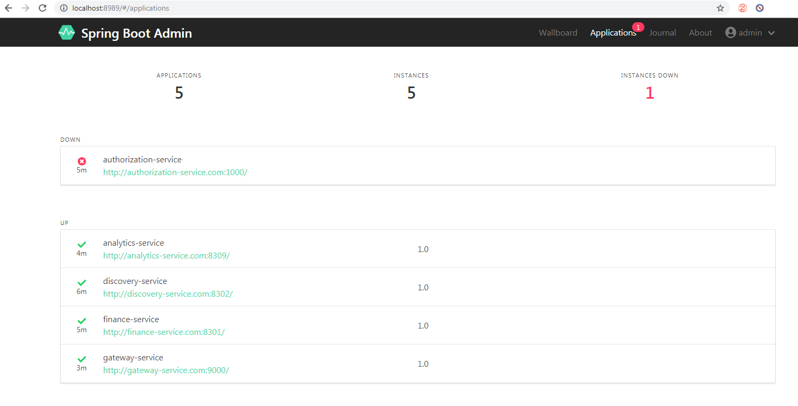
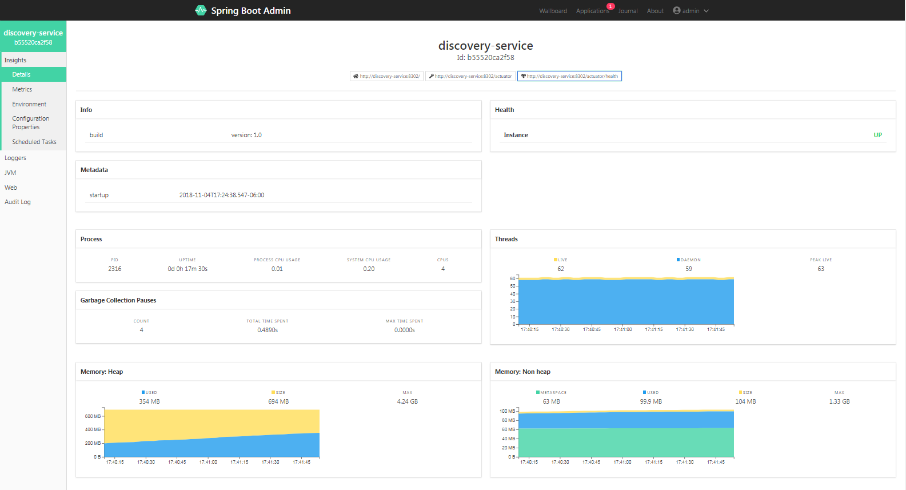
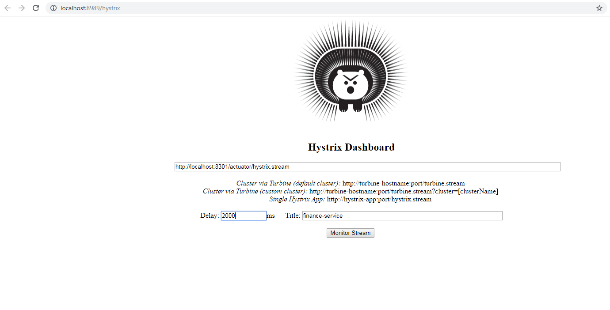
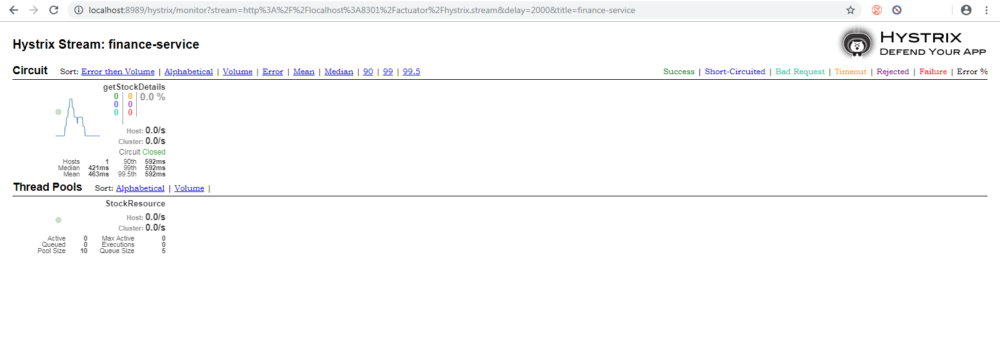

Monitor Service
=============

Monitor service provides both Spring Boot® Admin monitoring application as well as Netflix Hystrix Dashboard. 

### Running the Monitor Service

Pass the CONFIG_SERVICE_PASSWORD from the [config-service](../config-service/README.md) to access monitor-service.yml configuration file.

    $ java -jar monitor-service/build/libs/monitor-service-0.0.1-SNAPSHOT.jar
           -DCONFIG_SERVICE_PASSWORD=xxxx 

## Spring Boot® Admin

**[Spring Boot® Admin](https://github.com/codecentric/spring-boot-admin)** application is used for monitoring, managing and configuring Spring Boot Applications (micro-service) at Runtime. Each microservice registers with spring boot admin server and provides access to Spring Boot Actuator endpoints. [Spring Boot Admin](http://codecentric.github.io/spring-boot-admin/current/) provides application health status, memory/cache status, build info, view environment properties, loglevel management, http-traces, http endpoints, heapdump and notification for status changes.  
To view the Spring Boot Admin use the below URL and enter the username **admin** and password same as value of property **spring.security.user.password** specified in monitor-service.yml :

http://localhost:8989/admin

   
   
   
   

## Netflix Hystrix Dashboard

Circuit Breaker pattern allows to gracefully degrade functionality when a method call fails. Circuit Breakers hence allow a microservice to continue operating when a related service fails, preventing the failure from cascading and giving the failing service time to recover, thus improving the system’s overall resiliency. [Hystrix](https://github.com/Netflix/Hystrix/wiki) wraps all the calls to external systems (or “dependencies”) in a [HystrixCommand](https://github.com/Netflix/Hystrix/wiki/How-it-Works) or HystrixObservableCommand object which typically executes within a separate thread which is part of a smaller thread-pool. It stop all requests to a particular service for a period of time either manually or automatically if the error percentage for the service passes a threshold. It also time-out service calls which take longer than predefined thresholds.
**[Netflix Hystrix Dashboard](https://github.com/Netflix-Skunkworks/hystrix-dashboard)** is a dashboard for monitoring micro services using Hystrix circuit breakers. The Hystrix Dashboard displays the health of each circuit breaker in an efficient manner. The [Netflix Turbine Stream Aggregator](https://github.com/Netflix/Turbine) connects to Hystrix-enabled servers and aggregates realtime streams from them.

### Hystrix Dashboard and Monitoring Circuit Breaker status

View the [Hystrix Dashboard](https://cloud.spring.io/spring-cloud-netflix/multi/multi__hystrix_timeouts_and_ribbon_clients.html) with below URL:

http://localhost:8989/hystrix

   
   
##### For Monitoring with Hystrix Stream

Enter Host input: http://localhost:8301/actuator/hystrix.stream to monitor circuit breakers for finance-service application or  
                  http://localhost:8309/actuator/hystrix.stream for analytics-service application.

   

##### For Monitoring with Turbine Stream

Enter Host input: http://localhost:8989/turbine.stream?cluster=FINANCE-SERVICE  (or ANALYTICS-SERVICE to monitor analytics-service)  
Delay: 2000  
Title: My Dashboard Title  

Click "Monitor Stream" to view Hystrix Dashboard for the provided input stream.
